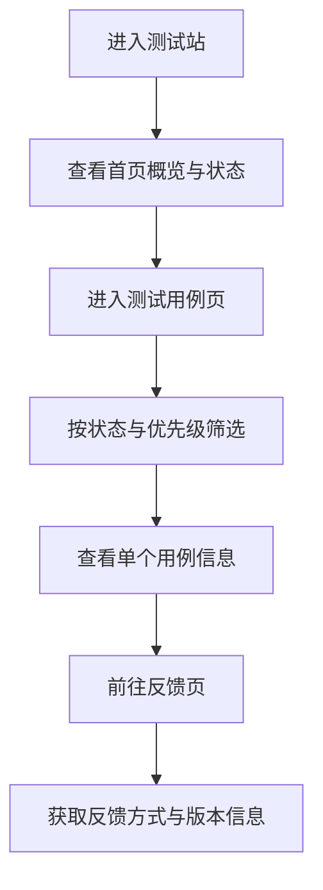

## 1. 产品概述
测试站是一个用于页面验收、组件展示、交互验证与提测反馈的轻量网站，适合研发、测试、产品在同一入口下快速完成联调与演示。
- 解决分散测试入口、状态不透明、反馈零散的问题
- 为内部提测、版本走查、功能验收提供统一展示与记录界面

## 2. 核心功能

### 2.1 功能模块
1. **首页**：站点介绍、当前测试状态、快速入口、最近更新
2. **测试用例页**：用例卡片、状态筛选、优先级标记、关键指标展示
3. **反馈页**：反馈说明、提交流程、联系方式、版本信息

### 2.2 页面详情
| 页面名称 | 模块名称 | 功能说明 |
|----------|----------|----------|
| 首页 | 首屏概览 | 展示测试站定位、版本号、环境标签、主操作按钮 |
| 首页 | 状态面板 | 展示通过率、阻塞项、活跃用例、最近更新时间 |
| 首页 | 快速入口 | 跳转到用例页、反馈页、文档区块 |
| 测试用例页 | 用例筛选 | 按状态、优先级、模块筛选演示数据 |
| 测试用例页 | 用例卡片 | 展示名称、说明、负责人、状态、标签 |
| 测试用例页 | 发布看板 | 展示本轮测试重点、风险项、发布建议 |
| 反馈页 | 反馈流程 | 呈现提测反馈步骤、处理时效、建议渠道 |
| 反馈页 | 联系方式 | 提供邮箱、群组、值班窗口等静态信息 |
| 反馈页 | 版本记录 | 展示当前测试版本、更新时间、说明摘要 |

## 3. 核心流程
访问者进入首页，先查看当前测试轮次状态与重点指标，再进入测试用例页筛选并查看演示用例，最后在反馈页获取提交流程与沟通方式，完成测试闭环。

## 4. 用户界面设计
### 4.1 设计风格
- 主色：深墨蓝、荧光青、雾灰白
- 按钮风格：圆角矩形配轻微发光描边
- 字体：标题使用有机械感的展示字体，正文使用清晰易读的无衬线字体
- 布局风格：桌面优先的大面积看板布局，辅以卡片栅格与侧边信息块
- 图形建议：使用网格、扫描线、状态徽章与数据面板强化测试氛围

### 4.2 页面设计概览
| 页面名称 | 模块名称 | UI 元素 |
|----------|----------|----------|
| 首页 | 首屏概览 | 深色背景、数据高亮、渐变光晕、双按钮操作区 |
| 首页 | 状态面板 | 指标卡片、标签徽章、细描边、悬停上浮 |
| 测试用例页 | 用例筛选 | 胶囊筛选按钮、数字统计、列表切换区 |
| 测试用例页 | 用例卡片 | 状态色条、负责人头像占位、标签群组 |
| 反馈页 | 反馈流程 | 时间线样式、步骤编号、信息块对齐排版 |
| 反馈页 | 联系方式与版本记录 | 信息卡、提示条、弱动效背景纹理 |

### 4.3 响应式策略
采用桌面优先设计，兼容平板与移动端；在小屏下将多列看板折叠为单列，保留筛选、状态卡和反馈信息的可读性，并优化按钮触控区域。
