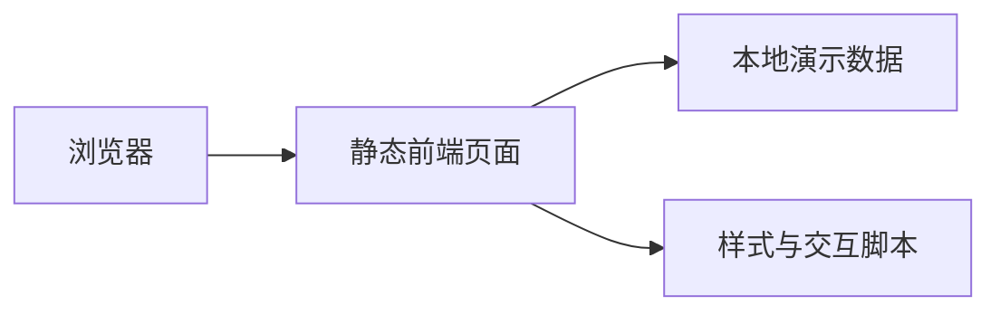
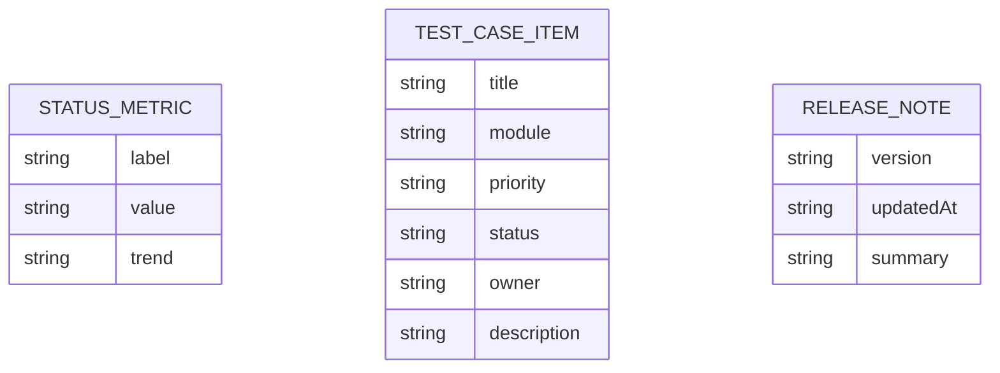

## 1. 架构设计


## 2. 技术说明
- 前端：HTML5 + CSS3 + 原生 JavaScript
- 初始化方式：基于现有静态站模板改造
- 后端：无
- 数据：本地内置 mock 数据，用于展示测试用例、状态指标与版本信息

## 3. 路由定义
| 路由 | 用途 |
|------|------|
| /website/index.html | 首页，展示测试站概览与核心指标 |
| /website/about.html | 测试用例页，展示筛选与用例卡片 |
| /website/contact.html | 反馈页，展示提交流程与联系信息 |

## 4. API 定义
当前方案为纯静态演示站，不引入后端接口。页面数据通过前端脚本内置 JSON 对象提供。

```ts
type StatusMetric = {
  label: string;
  value: string;
  trend: string;
};

type TestCaseItem = {
  title: string;
  module: string;
  priority: 'P0' | 'P1' | 'P2';
  status: '通过' | '进行中' | '阻塞';
  owner: string;
  description: string;
  tags: string[];
};

type ReleaseNote = {
  version: string;
  updatedAt: string;
  summary: string;
};
```

## 5. 数据模型
### 5.1 数据模型定义


### 5.2 数据组织说明
- `metrics`：用于首页指标卡片
- `testCases`：用于测试用例页筛选与卡片列表
- `releaseNote`：用于反馈页与首页版本摘要
- `contacts`：用于反馈页静态联系信息展示

## 6. 实现要点
- 复用现有三页面结构，降低改造成本并确保可直接静态部署
- 使用 CSS 变量统一主题色、阴影、描边和间距
- 使用少量原生 JavaScript 实现筛选、高亮和动态渲染
- 保持零构建依赖，便于直接预览、交付与后续扩展
